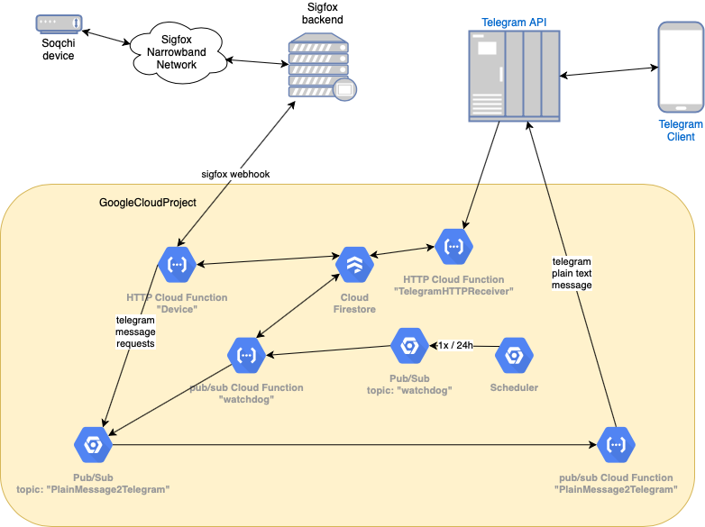
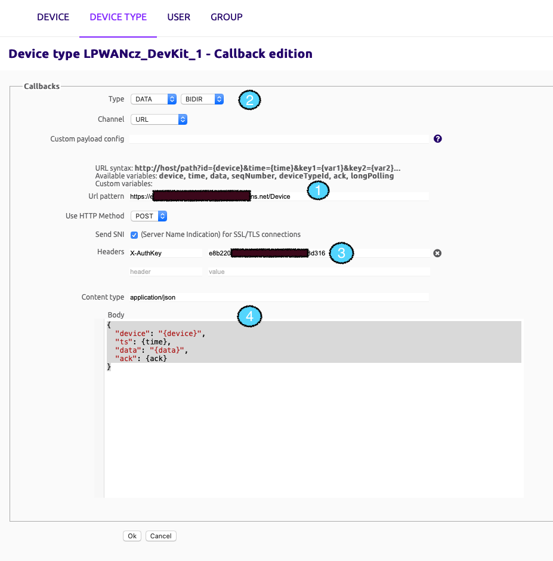
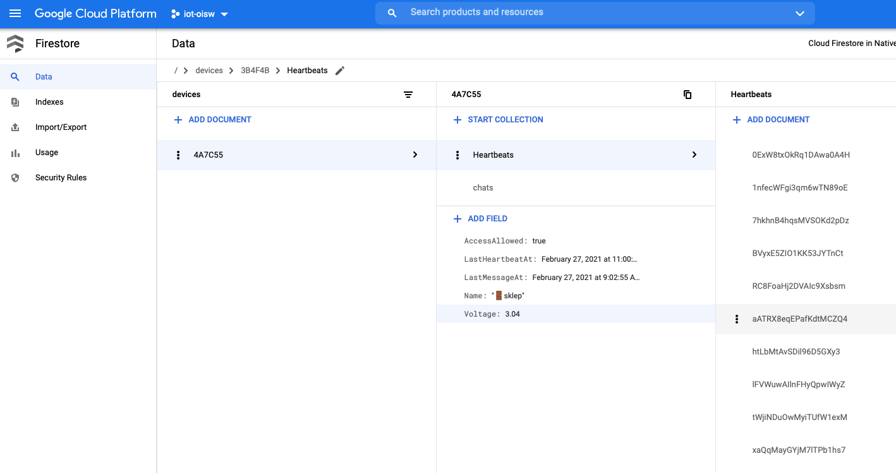

# Soqchi go

## Stručně

Jde o serverovou část pro snímač se Sigfoxem [Soqchi](../soqchi/README.md) implementovanou v jazyce Go a provozovanou 
jako server-less řešení na Google Cloud Platformě. Díky parametrům, které nabízí Free-tier pro uživatele (např. 1 mil. 
vyvolání cloudových funkcí zdarma), tak provoz této "hračky" je zdarma se všemi "bells and whistles", které google
cloud nabízí - tedy např. logování, telemetrie aplikace, robustnost. Z principu je toto řešení ideální pro podobný typ 
aplikace, protože serverová část většinu času nic nedělá. Do provozu se probudí zprávou ze zařízení (via Sigfox backend
webhook), zprávou přes messenger Telegram pomocí [Telegram Bot API](https://core.telegram.org/bots) nebo schedulerem
(periodická kontrola, zda se zařízení ozývá a není mrtvé).

## Technologie

* Google Cloud Function - "serverless" řešení služeb
* Google Firestore - dokumentová databáze 
* Google Pub/Sum - cloudový messaging pro asynchronní zpracování
* Google Cloud Scheduler - plánovač dle času




## Google Cloud Functions


#### Watchdog (gcf_watchdog.go)

Je pub/sub GCF vyvolávaná zprávou do Google Pub/Sub cloud služby a  topicu s názvem "watchdog". 
Zprávu heneruje Google Cloud Scheduler každý den v cca 8.00 CET
a zpráva má prázdný payload. Její vyvolání provede kontrolu, zda se všechna zařízení ozvala za posledních 24 hodin
a zda napětí není podlimitní (aktuálně nastaveno na 2.7V). Pokud některá z podmínek provozu není splněna, je 
vše příjemcům zpráv z daného zařízení generována notifikace do Telegramu.

#### PlainTelegramMessage (gcf_plain_telegram_message.go)

Je GCF spouštěná zprávou do Google Pub/Sub cloud služby s topicem `PlainTelegramMessage` a jen zajistí rozeslání
textové zprávy na specifikované chaty. 

#### TelegramHTTPReceiver (gcf_telegram.go)

Je HTTP GCF vyvolávaná webhookem Telegram Bota (viz níže popsaný setup). Aktuálně obsluhuje pouze dva commandy

* `/register <deviceID>` - přihlásí uživatele k odběru zpráv z daného zařízení
* `/voltage <deviceID>` - zašle graf s hodnotami napětí za posledních 30 dní, jak zařízení naposílalo zprávami
typu "Heartbeat" - generováno 1x za cca 24 hodin (generování není zcela přesné - zařízení nemá Real Time Clock obvod)
  
#### Device (gcf_device.go)

Je HTTP GCF vyvolávaná ze (Sigfox backendu)[https://backend.sigfox.com/device/list] - pro správné "dekódování" zprávy 
je třeba v nastavení webhooku nastavit zaslání pomocí POST operace s následujícím payloadem:

```
{
  "device": "{device}",
  "ts": {time},
  "data": "{data}",
  "ack": {ack}
}
```

Celé nastavení v Sigfox backendu:



1. URL, na kterém je deploynutá GCF "Device" (viz popis níže)
1. Je třeba nastavit typ webhooku "Data" a povolit obosměrnou komunikaci - do zařízení se v případě alarmu přenáší hodnota
    `AccessAllowed` z Firestore databáze pro dané zařízení, umožnující vyvolat externí alarm (např. sirénu), pokud jde
   o nepovolený přístup (předem neohlášený)
1. Hlavička s hodnotou klíče, která brání vyvolání - resp. neoprávněnému spuštění, funkce. Pokud hodnota klíče nesouhlasí
    s nastavení, které má GCF "Device", je klientovi vrácena hodnota 403 - Forbidden
1. Vlastní `application/json` payload se substitucí hodnot zaslaných zařízením


### Deployment do google cloud functions (GCF)

K deploymentu je třeba mít:

* na google cloudu založený projekt s aktivovanými Google Cloud Functions a Firestore databází
* vygenerovaný autentikační JSON - generuje se v Google Cloud konzoli na webu
* vytvořený yaml soubor, kde jsou proměnné prostředí (klíče pro Telegram API, klíč pro Webhook)

gcf_soqchi.env.yaml:

```
BOT_TOKEN: "165640:AAGg__________________Vk4"
TELEGRAM_KEY: BNKxh_______________QTL
DEVICE_KEY: e8b22____________________316
GOOGLE_CLOUD_PROJECT: my-project
```

Vlastní deployment na servery je ve scriptu [deploy.sh](./deploy.sh) pro snadnější spouštění, jinak je samozřejmě možné
deployment pomocí Google Cloud CLI provádět ručně dle potřeby.

## Google Firestore

Pro ukládání dat (seznam příjemců zpráv, historie heartbeatů, poslední hodnota napěti, atp.) je použita Google
Firestore databáze. Pro úvodní setup je třeba založit kolekci s názvem "devices" a do ní vložit prázdný dokument s ID,
které odpovídá ID Sigfox zařízení. Zařízení lze pojmenovat vložením string stributu `Naame`.
Další kolekce jsou pak již založeny automaticky.

Pohled na GUI Firestore (ID zařízení je fiktivní):




## Telegram API

Pro fungování je třeba:

* zřídit nového bota pomocí [BotFathera](https://core.telegram.org/bots#3-how-do-i-create-a-bot)
* nastavit pro něj webhook pomocí Bot API

```

curl -X POST -H "Content-type: application/json" https://api.telegram.org/bot<token>/setWebhook --data-binary @- <<!
{
  "url" : "<cloud function URL>?k=<key>"
}
!
```

kde `token` je token vrácený BotFatherem, který byl vrácen při vytvoření bota. Hodnota `key` je 
je náhodný řetězec, který chrání webhook na Google Cloudu před vyvoláním různými scannery, spamboty, atp. Stejnou
hodnotu je třeba nastavit na i na druhé straně, tedy v cloudové funkci, která je webhookem trigerována.
