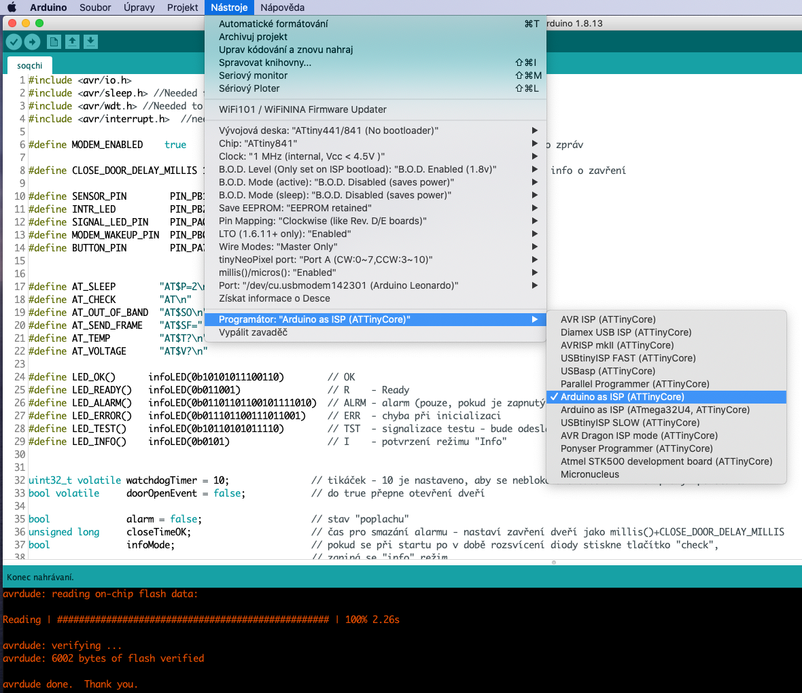
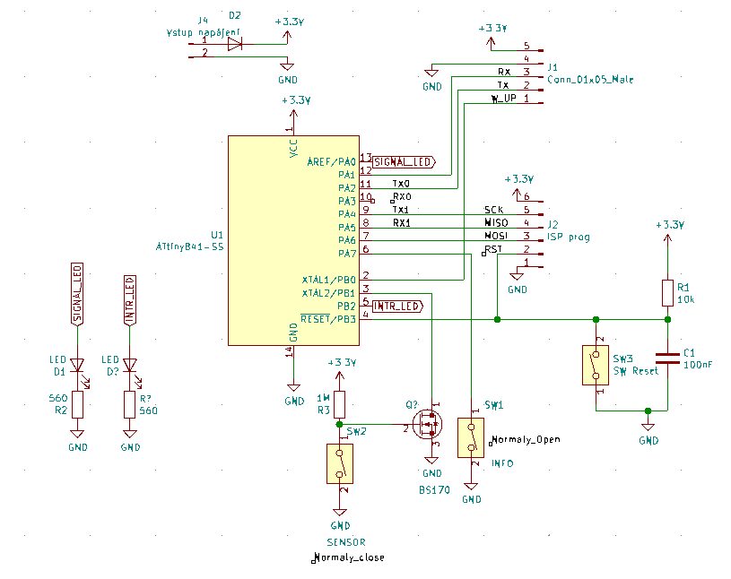

# Soqchi - hlídač dveří

## Úvod

Nápad na tento miniprojektík,nza účelem vyzkoušení technologie Sigfox vznikl z mého náhlého popudu, leč následně 
reaálné obrysy získal až pod metodickým vedením Pavla Šteffana, za čož mu tímto děkuji. 
V jeho hlavě se zrodila myšlenka využití mikročipu
[ATTiny 841](https://ww1.microchip.com/downloads/en/DeviceDoc/Atmel-8495-8-bit-AVR-Microcontrollers-ATtiny441-ATtiny841_Datasheet.pdf),
celkové schéma zapojení a proměření výsledné konfigurace za účelem zajištění co nejmenší spotřeby.

## Popis

Program hlídá dveřní čidlo a pokud dojde k přerušení obvodu, je odeslána alarm zpráva 
pomocí SIGFOX modemu. Pokud dojde k uzavření dveří a toto uzavření trvá definovanou dobu
(nastaveno na cca 120 sekund), je odeslána info zpráva. Informační zpráva je také odeslána
každých cca 48 hodin (heartbeat), která nese informaci o stavu dveřního 
snímače, teplotě a napětí baterie.

Pro snížení spotřeby je vlastní obvod i modem většinu času ve stavu spánku a pomocí
přerušení (INTERRUPT) od watchdogu nebo čidla se probouzí. Ve stavu alarmu (tedy po probuzení
vyvolaném přerušením na snímači) je procesor v nekonečné smyčce, kdy kontroluje stav snímače
(zda už nejsou dveře zavřeny) a stav tlačítka "test".

Při startu se rozsvítí na cca 2s informační dioda. Pokud dojde je v této době  podržení
test tlačítka, je program v "info" módu:

* každých cca 8 sec po probuzení ze spánku dioda krátce problikne
* pokud je úspěšně odeslán alarm modemem, vybliká dioda "ALRM" v morseovce

Pokud není tlačítko test stisnuto v době, kdy svítí dioda, je nastaven tichý mód 
- dioda pravidelně nebliká, alarm také není signalizován blikáním. 

I v tichém módu však dioda signalizuje:

* po inicializaci modemu vybliká:
  * "R" - pokud je modem úspěšně inicializován a uspán
  * "ERR" - pokud se inicializace modemu nezdařila
* stisknutí tlačítka "test" vybliká "TST" 

Tlačítko "test" (musí být dveřní čídlo rozpojeno => dveře otevřeny), odesílá informační datovou zprávu - viz. dále.

## HW

## Sigfox modem

Pro toto zapojení je použitý vývojový kit 
[LPWAN Sigfox Node](https://dratek.cz/arduino/1584-iot-lpwan-sigfox-node-uart-modem-868mhz-vcetne-anteny-a-programatoru.html)

Modul samotný (modem) se chová mravně a nezáludně a funguje v podstatě na první dobrou. Co je v počátku překážkou
největší je samotná registrace modemu a pak samotné nastavení webhooků v prostředí backend.sigfox.com - UX zapláče...

### Programování ATTiny841

Jako mikroprocesor je použitý 8-bit ATTiny841 a k jeho naprogramování je použito Arduino jako ISP. Popis, celého procesu
je na stránkách [ATTiny x41](https://github.com/SpenceKonde/ATTinyCore/blob/master/avr/extras/ATtiny_x41.md). 
Před  použitím Arduina jako ISP programátoru je třeba si přečíst i dokumentaci
[Arduino as ISP and Arduino Bootloaders](https://www.arduino.cc/en/Tutorial/BuiltInExamples/ArduinoISP). Pro úspěsné
naprogramování je pak třeba splnit tyto body:

* správně propojit Arduino a ATTiny841, jak je popsáno v [ATTiny x41](https://github.com/SpenceKonde/ATTinyCore/blob/master/avr/extras/ATtiny_x41.md)
* do Arduina nahrát program "ISP" (dostupný v příkladech)
* nezapomenout mezi piny RESET a GND arduina dát kondenzátor 10µF - jinak programování selhává
* do Arduino IDE nainstalovat [ATTinyCore plugin](https://github.com/SpenceKonde/ATTinyCore/blob/master/Installation.md)
* správně v menu nástroje nastavit parametry
* nezapomenout při stisku ikonky "Nahrát" v Arduino IDE držet klávesu shift, aby nahrání proběhlo přes programátor

### Schéma zapojení:

Přerušení (a tím probuzení ze spánku) může být vyvoláno:

* dveřním čidlem
* interním časovačem (wathdog)

Kromě signalizační info diody, lze zapojit INTR_LED (defaultně pin PIN_PB2), která se rozsvítí okamžitě po otevření
dveří.

## Datové zprávy 

Datové zprávy jsou odeslány na SIGFOX cloud.

* alarm - datová zpráva nese pouze jeden bajt s hodnotou 0xFF
* info zpráva - je odeslána po stisku tlačítka "test":
   * data[0]
      * 00 - dveře jsou zavřené
      * 01 - dveře jsou otevření
   * data[1-3] - ASCII číslice s hodnotou teploty čidla (x10)
   * data[4-9] - ASCII číslice s hodnotou napětí v mV

## Dokumentace

* [ATTiny x41 pro Arduino IDE](https://github.com/SpenceKonde/ATTinyCore/blob/master/avr/extras/ATtiny_x41.md)
* [ATTiny 841 datasheet](https://ww1.microchip.com/downloads/en/DeviceDoc/Atmel-8495-8-bit-AVR-Microcontrollers-ATtiny441-ATtiny841_Datasheet.pdf)

